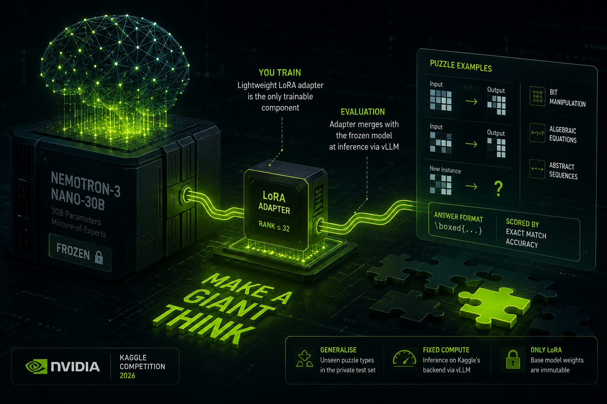
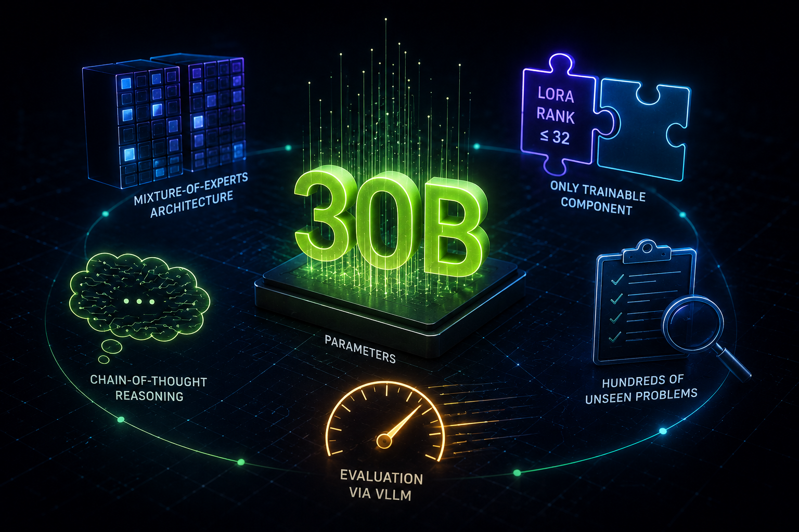
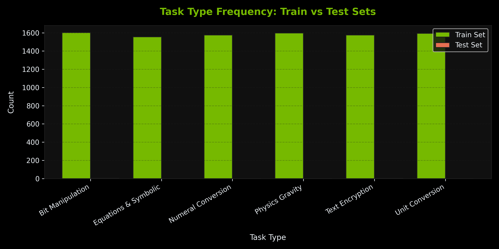
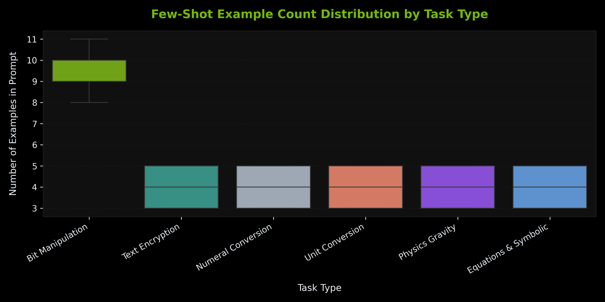
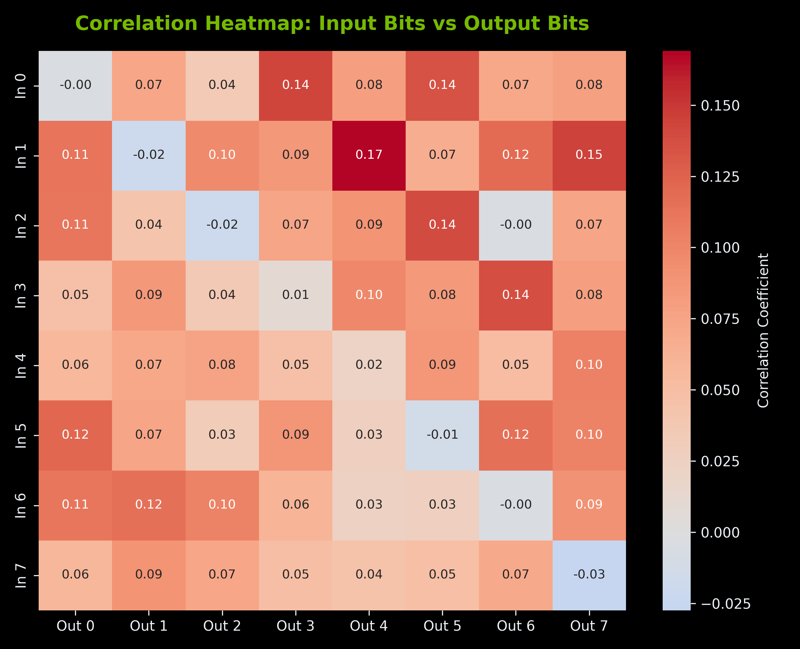
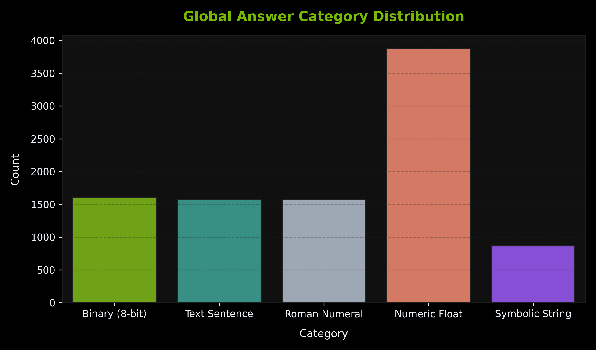
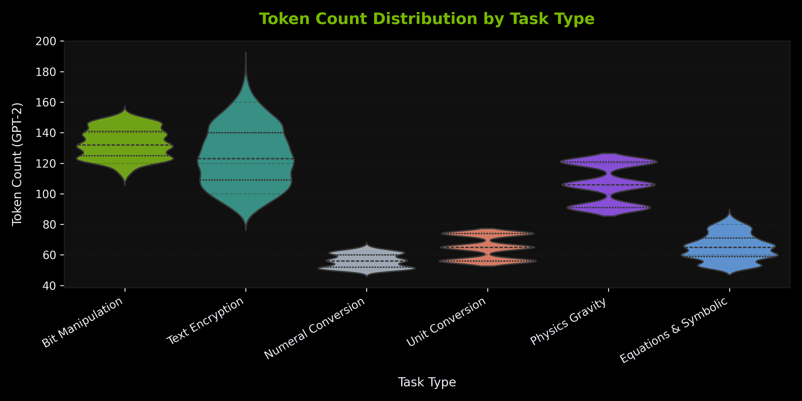

<!-- _class: cover -->
<!-- _paginate: false -->

Kaggle · NVIDIA · 2026

# NVIDIA Nemotron Model Reasoning Challenge

Team Moroco

  <b>Hosted by</b>NVIDIA on Kaggle
  <b>Model</b>Nemotron-3-Nano-30B
  <b>Method</b>LoRA adapter fine-tuning

---

# Teaching a Giant to Think

## What this competition is

- NVIDIA provides a **frozen 30B open model**; participants improve its reasoning behavior
- The allowed training mechanism is a lightweight **LoRA adapter**
- The adapter is merged with the base model at **evaluation time via vLLM**
- Success depends on generalisation to **unseen puzzle types**, not memorisation

---

# The Problem

## What the model must solve

- Each task provides **input–output examples** that imply a hidden rule
- The model must **infer the transformation** and apply it to a new case
- Puzzle families include **bit manipulation**, **algebraic equations**, and **abstract sequences**
- The final answer must be wrapped in `\boxed{}` and is scored by **exact match accuracy**

---

# Limitations & Constraints

## What is and is not permitted

- LoRA rank is **capped at 32**, so the adapter capacity is intentionally limited
- Base model weights are **immutable**; full fine-tuning is not allowed
- Inference runs under a **fixed compute budget** on Kaggle infrastructure
- The private test set is **fully held out**, so the public leaderboard may overestimate progress

---

# Exploratory Data Analysis

## Dataset quality and structure

6

Task Categories

9500

Training Samples

3

Test Samples

0

Duplicate Prompts or Missing Values

302

Avg Train Length

472

Avg Test Length

The dataset is clean, balanced, and requires virtually no preprocessing before fine-tuning.

---

# Task Taxonomy

  

---

# Few-Shot Prompt Structure

  

---

# Bit Manipulation Deep Dive

  

---

# Answer Format Distribution

  

---

# Tokenization Analysis

  

